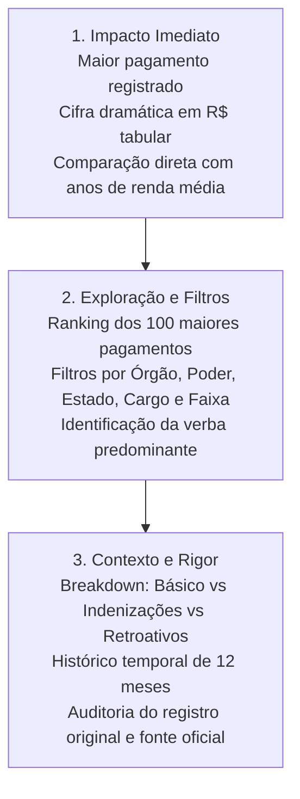

# 01. Visão do Produto

## 1. O Problema
Dados sobre remunerações no setor público brasileiro são amplamente disponibilizados em portais da transparência, mas permanecem quase inacessíveis ao cidadão comum por três motivos principais:
1. **Burocracia técnica:** Tabelas densas com siglas herméticas como "PAE", "ATS", "Vantagens Eventuais", "Indenizações".
2. **Sensacionalismo polarizador:** Coberturas midiáticas que transformam folhas de pagamento pontuais em manchetes distorcidas ("Juiz ganha R$ 1 milhão por mês"), ignorando a composição da verba.
3. **Ausência de escala e comparação:** O cidadão não tem referência imediata para compreender o impacto econômico daquele valor em relação à realidade do trabalho no Brasil.

## 2. A Solução: Fora da Curva
**Fora da Curva** é um produto de transparência pública, jornalismo de dados e inteligência cívica projetado para responder em segundos à pergunta:
> *"Quanto alguém recebeu este mês — e como isso se compara com a renda de um brasileiro comum?"*

### Princípio Editorial Fundamental
> **"Quanto mais chocante o número, mais rigorosa deve ser a explicação."**

A plataforma não foi concebida para “caçar servidor” ou incentivar linchamento virtual. O sistema exibe o valor bruto e líquido efetivamente registrado, decompõe item a item a sua natureza (remuneração básica, vantagens, indenizações, retroativos) e detalha o histórico temporal para evidenciar se aquele evento foi pontual ou recorrente.

## 3. Os Três Níveis de Experiência

## 4. Público-Alvo
- **Cidadãos e Contribuintes:** Que desejam compreender para onde vão os recursos públicos sem intermediários enviesados.
- **Jornalistas e Pesquisadores:** Que necessitam de fontes auditáveis, links diretos para os órgãos oficiais e metodologia clara.
- **Órgãos de Controle e Gestores Públicos:** Que se beneficiam de uma ferramenta comparativa de distorções estruturais e verbas indenizatórias.

## 5. Autoria e Co-autoria Científico-Técnica

- **Willian Albarello** ([@walbarellos](https://instagram.com/walbarellos)) — Engenheiro e Arquiteto de Software, Responsável pela Arquitetura, Modelagem de Dados e Engenharia da Plataforma.
- **Wenrrison Nogueira** ([@nswenrrisonchris](https://instagram.com/nswenrrisonchris)) — Co-autor, Responsável pela Concepção Teórico-Conceitual e Formulação da Problemática de Transparência Pública.

