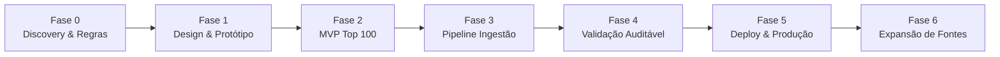
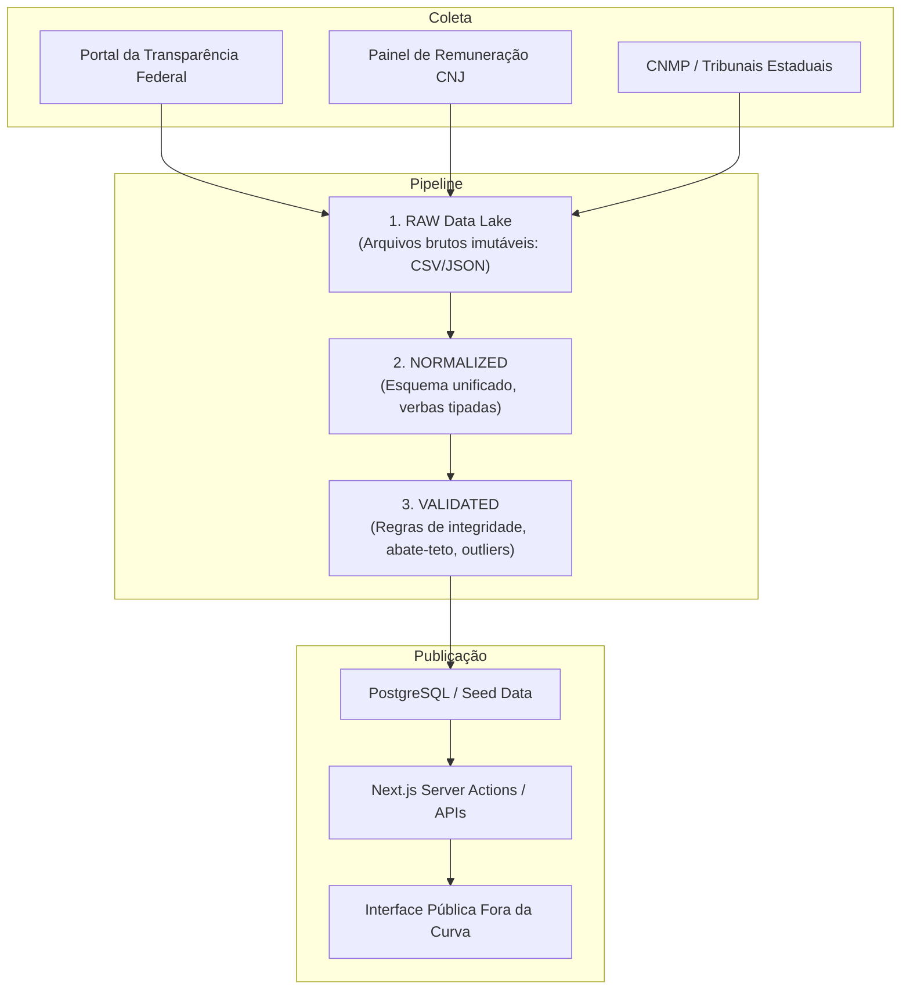

# 03. Arquitetura do Sistema

## 1. Abordagem Metodológica
Rejeitamos abordagens puramente cascata (lentas e rígidas) ou prototipagem rápida desorganizada (RAD sem documentação).
Adotamos **Desenvolvimento Ágil com Arquitetura Incremental**:

## 2. Stack Tecnológica Selecionada

### Camada de Apresentação & SSR
- **Framework:** Next.js (App Router) + TypeScript.
  - *Justificativa:* Combina renderização no servidor (SSR) e geração estática (SSG/ISR) para alta performance, SEO e URLs canônicas indexáveis.
- **Estilização:** Tailwind CSS v4 / v3.4 + tokens semânticos de cores editoriais.
- **Componentes:** shadcn/ui patterns (acessíveis via Radix Primitives).
- **Ícones:** Lucide React (apenas traços limpos, zero emojis decorativos na interface).
- **Gráficos e Visualizações:** Recharts (para timelines e barras de verba) com suporte a cores temáticas.

### Camada de Dados & Backend (Evolutiva)
- **Fase MVP (M1/M2):** Conjunto estático curado e tipado (`data/seed-top100.json` + TypeScript data access layer) garantindo velocidade imediata e zero custo de infraestrutura no primeiro lançamento.
- **Fase de Escala (M3+):**
  - **Banco de Dados:** PostgreSQL com índices otimizados para busca temporal e monetária.
  - **ORM:** Drizzle ORM para consultas fortemente tipadas e sem sobrecarga de runtime.
  - **Pipeline de Extração:** Scripts em Python para scraping, download de CSVs/JSONs dos portais e normalização para Parquet/Postgres.

## 3. Pipeline de Dados

## 4. Estratégia de Deploy
- Hospedagem e CDN: Vercel / Cloudflare Pages.
- Edge Caching para rotas estáticas (`/metodologia`, `/ranking`).
- Revalidação incremental (ISR) configurada para quando novas competências forem extraídas do pipeline.
