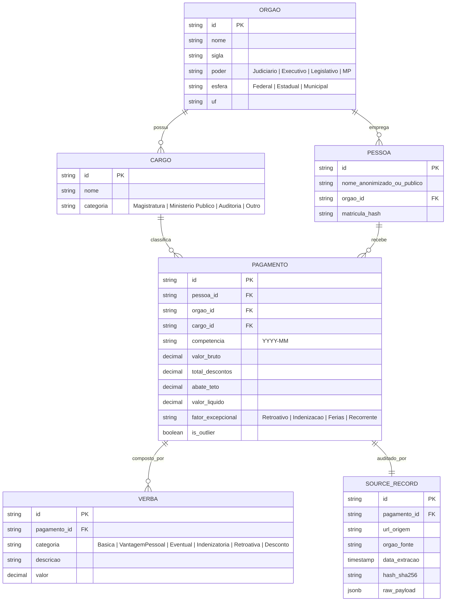

# 06. Modelo de Dados

O modelo de dados do **Fora da Curva** foi desenhado para ser relacional, normalizado e com rastreabilidade completa até o registro original.

## Diagrama Entidade-Relacionamento



## TypeScript Interfaces (TypeScript Data Layer)

```typescript
export type Poder = 'Judiciário' | 'Executivo' | 'Legislativo' | 'Ministério Público';
export type Esfera = 'Federal' | 'Estadual' | 'Municipal';

export type CategoriaVerba = 
  | 'Remuneração Básica'
  | 'Vantagens Pessoais'
  | 'Vantagens Eventuais'
  | 'Indenizações'
  | 'Retroativos'
  | 'Descontos Oficiais';

export interface ItemVerba {
  id: string;
  categoria: CategoriaVerba;
  descricao: string;
  valor: number;
}

export interface HistoricoMensal {
  competencia: string; // "Jan", "Fev", "2026-01", etc.
  valorBruto: number;
  valorLiquido: number;
}

export interface PagamentoRegistro {
  id: string;
  posicaoRanking: number;
  orgao: string;
  orgaoSigla: string;
  poder: Poder;
  esfera: Esfera;
  uf: string;
  cargo: string;
  competencia: string; // "09/2026"
  ano: number;
  mes: number;
  valorBruto: number;
  abateTeto: number;
  descontosLegais: number;
  valorLiquido: number;
  fatorPredominante: 'Retroativo' | 'Indenização' | 'Férias / 13º' | 'Salário Recorrente' | 'Outros';
  resumoExplicativo: string;
  verbas: ItemVerba[];
  historico: HistoricoMensal[];
  fonteOficial: {
    nomePortal: string;
    urlOriginal: string;
    dataAtualizacao: string;
    hashAuditoria: string;
  };
  comparativos: {
    anosRendaMedia: number; // Ex: 26.7
    mesesRendaMedia: number; // Ex: 320
    multiploSalarioMinimo: number; // Ex: 720
  };
}
```
