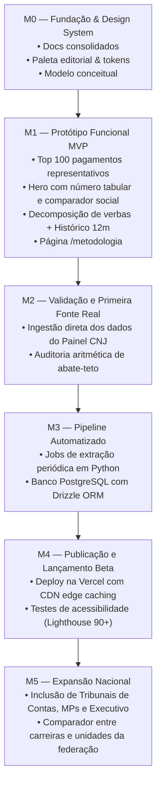

# 11. Roadmap do Projeto

## Marcos de Desenvolvimento

### Detalhamento das Fases

### M0 — Fundação (Concluído)
- [x] Conceituação do produto e diretrizes editoriais.
- [x] Especificação funcional e não-funcional.
- [x] Definição de design system, tipografia e regras de acessibilidade.
- [x] Documentação técnica completa em 11 volumes.

### M1 — MVP: "Os 100 Maiores Pagamentos" (Em Execução)
- [ ] Scaffold do Next.js com Tailwind CSS e TypeScript.
- [ ] Criação do dataset semente estruturado com 100 casos reais e decomposição de rubricas.
- [ ] Implementação da Homepage (Hero dramático, estatísticas, comparador de renda de referência).
- [ ] Implementação da Tabela Ranking com filtros reativos.
- [ ] Implementação da tela individual `/pagamento/[id]` com histórico temporal e breakdown.
- [ ] Implementação de `/metodologia`.

### M2 — Integração da Primeira Fonte Real
- [ ] Conector para extração de microdados do CNJ.
- [ ] Mapeamento automatizado de rubricas para as 6 categorias canônicas.

### M3 — Infraestrutura de Dados Persistente
- [ ] Migração do dataset para PostgreSQL gerenciado.
- [ ] Rotinas de validação de integridade por hash SHA-256.

### M4 — Lançamento e Divulgação
- [ ] Lançamento público para jornalistas de dados e pesquisadores.
- [ ] Auditoria independente de dados abertos.
